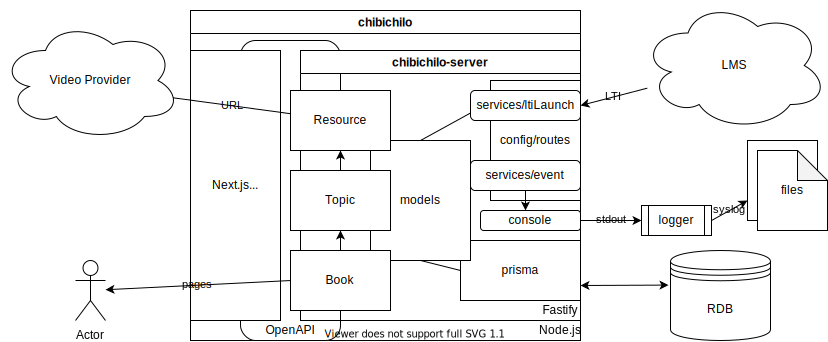

# アーキテクチャの概要

## 全体構成

プログラミング言語としては、Web ブラウザーのスクリプト言語 JavaScript との親和性が高く、多くの開発者にとって比較的学習が容易な [TypeScript](https://www.typescriptlang.org/) を採用。

## Code Map

### server ([code](https://github.com/npocccties/ChibiCHiLO/tree/master/server), [docs](https://github.com/npocccties/ChibiCHiLO/tree/master/server#readme))

[REST API](https://developer.mozilla.org/ja/docs/Glossary/REST) の提供と静的ファイルの配信を担うサーバー。[Node.js](https://nodejs.org/) で実行。

### server/models ([code](https://github.com/npocccties/ChibiCHiLO/tree/master/server/models))

システム内のコアとなるデータの型。また、[JSON Schema](https://json-schema.org/)。ビジネスロジックのなかの不変な概念。UI 側の実装からも依存される。

### server/types ([code](https://github.com/npocccties/ChibiCHiLO/tree/master/server/types))

TypeScript における型注釈。server/models と若干役割が被ってしまっているが、こちらのほうがどちらかというとそれほど重要でない概念。UI 側からは依存されない。

### server/services ([code](https://github.com/npocccties/ChibiCHiLO/tree/master/server/services))

REST API の仕様と権限の宣言、主要なリクエストの処理と制御を行う。

### server/auth ([code](https://github.com/npocccties/ChibiCHiLO/tree/master/server/auth))

リクエストの処理と制御のうち、認証に関わる処理を行う。

### server/prisma ([code](https://github.com/npocccties/ChibiCHiLO/tree/master/server/prisma))

[Prisma](https://www.prisma.io/) のためのディレクトリ。 [Prisma の公式ドキュメント](https://www.prisma.io/docs/)を参照してください。

### server/config ([code](https://github.com/npocccties/ChibiCHiLO/tree/master/server/config))

サーバーの構成。

### server/config/app.ts ([code](https://github.com/npocccties/ChibiCHiLO/blob/master/server/config/app.ts))

サーバー起動時の全般的な構成。Fastify インスタンスへのハンドラーの注入。

### server/config/roles.ts ([code](https://github.com/npocccties/ChibiCHiLO/blob/master/server/config/roles.ts))

利用者と LTI v1.1 ロールの完全修飾 URN との対応関係。権限の制御に利用。

### server/config/routes ([code](https://github.com/npocccties/ChibiCHiLO/tree/master/server/config/routes))

REST API のルーティング構成。

### server/config/seeds ([code](https://github.com/npocccties/ChibiCHiLO/tree/master/server/config/seeds))

シーディング (`yarn --cwd server seed` コマンド) 用のデータ。

### server/config/video ([code](https://github.com/npocccties/ChibiCHiLO/tree/master/server/config/video))

URL と動画配信プロバイダーの URL との対応関係。

### server/validators ([code](https://github.com/npocccties/ChibiCHiLO/tree/master/server/validators))

リクエストの前処理を行うためのデータ構造の宣言。server/models と若干役割が被ってしまっているが、こちらのほうがどちらかというとそれほど重要でない概念。UI 側からは依存されない。

### server/utils ([code](https://github.com/npocccties/ChibiCHiLO/tree/master/server/utils))

ユーティリティやヘルパー関数。補助的な機能の提供。

### server/main.ts ([code](https://github.com/npocccties/ChibiCHiLO/blob/master/server/main.ts))

サーバー起動時に実行されるエントリーポイント。Fastify インスタンス生成と実行、およびサーバーの構成 (server/config) の注入。

### types ([code](https://github.com/npocccties/ChibiCHiLO/tree/master/types))

TypeScript における型注釈。server/models と若干役割が被ってしまっているが、こちらのほうがどちらかというとそれほど重要でない概念。UI 側の実装からのみ依存される。

### store ([code](https://github.com/npocccties/ChibiCHiLO/tree/master/store))

UI の状態管理用。[jotai](https://github.com/pmndrs/jotai)を使用。components/atoms、components/molecules からは依存されない。

### store/session.ts ([code](https://github.com/npocccties/ChibiCHiLO/blob/master/store/session.ts))

セッションと権限の管理。

### theme ([code](https://github.com/npocccties/ChibiCHiLO/tree/master/theme))

テーマカラーなどの設定。

### components ([code](https://github.com/npocccties/ChibiCHiLO/tree/master/components))

React Component。

### components/atoms ([code](https://github.com/npocccties/ChibiCHiLO/tree/master/components/atoms))

[Atomic Design Methodology における Atoms](https://atomicdesign.bradfrost.com/chapter-2/#atoms)。

### components/molecules ([code](https://github.com/npocccties/ChibiCHiLO/tree/master/components/molecules))

[Atomic Design Methodology における Molecules](https://atomicdesign.bradfrost.com/chapter-2/#molecules)。

### components/organisms ([code](https://github.com/npocccties/ChibiCHiLO/tree/master/components/organisms))

[Atomic Design Methodology における Organisms](https://atomicdesign.bradfrost.com/chapter-2/#organisms)。

### components/templates ([code](https://github.com/npocccties/ChibiCHiLO/tree/master/components/templates))

[Atomic Design Methodology における Templates](https://atomicdesign.bradfrost.com/chapter-2/#templates)。

### pages ([code](https://github.com/npocccties/ChibiCHiLO/tree/master/pages))

テンプレートをもとに作られる実体とそれらのルーティング。

### utils ([code](https://github.com/npocccties/ChibiCHiLO/tree/master/utils))

ユーティリティやヘルパー関数。補助的な機能の提供。

### openapi ([code](https://github.com/npocccties/ChibiCHiLO/tree/master/openapi))

OpenAPI Generator (`yarn build:openapi` コマンド) によって生成するクライアントのコード。

### public ([code](https://github.com/npocccties/ChibiCHiLO/tree/master/public))

画像など静的ファイルの提供。UI のために使用。ロゴ画像の差し替えは[ビルド手順](INSTALL-ja.md)を参照してください。

### .github ([code](https://github.com/npocccties/ChibiCHiLO/tree/master/.github))

[Issue templates](https://docs.github.com/en/communities/using-templates-to-encourage-useful-issues-and-pull-requests/configuring-issue-templates-for-your-repository) や [GitHub Actions](https://github.co.jp/features/actions) のためのディレクトリ。

### .storybook ([code](https://github.com/npocccties/ChibiCHiLO/tree/master/.storybook))

[StoryBook](https://storybook.js.org/) のためのディレクトリ。[StoryBook の公式ドキュメント](https://storybook.js.org/docs/)を参照してください。

### samples ([code](https://github.com/npocccties/ChibiCHiLO/tree/master/samples))

StoryBook におけるストーリのためのサンプルデータ。

### api/v2.ts ([code](https://github.com/npocccties/ChibiCHiLO/blob/master/api/v2.ts))

[vercel.json](https://github.com/npocccties/ChibiCHiLO/tree/master/vercel.json)とともに [Vercel](https://vercel.com/) のためのファイル。[Vercel の公式ドキュメント](https://vercel.com/docs/configuration)を参照してください。

### docs/assets ([code](https://github.com/npocccties/ChibiCHiLO/tree/master/docs/assets))

ドキュメント用の図の画像など静的ファイルのためのディレクトリ。
