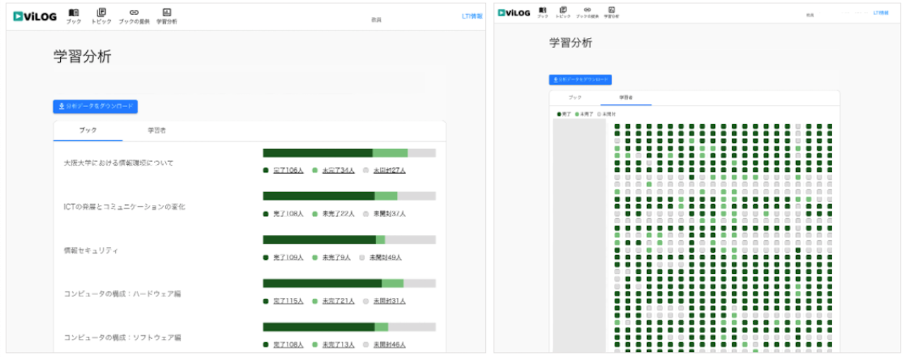

#  ViLOG: Video viewing LOG analytics system

[English](README-en.md) | [Japanese](README-ja.md)

ViLOG (Video viewing LOG analytics system) is an open-source video viewing behavior analysis system developed as the first step of an ongoing research project on engagement analytics for video-based learning. This system was developed as a Learning Tools Interoperability (LTI)-compliant tool so that it would be easy to implement in any environment and to extend features to validate the new framework.

This work was supported by MEXT "Innovation Platform for Society 5.0" Program Grant Number JPMXP0518071489.

## Functionality

### LTI Tool Provides

This system is developed as a [LTI tool provides](https://www.imsglobal.org/activity/learning-tools-interoperability "LTI tool provides") to be integrated with an LMS.

### Video Viewing Behavior Dashboard

The dashboard page is focused on confirming the overview of students' progress in real time. We defined students' progress at three levels "Completed," "Attempts," "Unopened," and collected progress data at one-second intervals. The image shows the viewing progress per video lecture.

### Video Viewing Behavior Dashboard

The system has a module for advanced analytics based on video.js to collect detailed video viewing behavior log data. This module saves video viewing log data such as play, pause, fast-forward, rewind, and playback speed changes every 10 seconds, in accordance with the log format defined by National Institute of Informatics (NII), Japan’s only general academic research institution.

## Citation

Shizuka Shirai, Masumi Hori, Masako Furukawa, Mehrasa Alizadeh, Noriko Takemura, Haruo Takemura and Hajime Nagahara. 2022. Design of open-source video viewing behavior analysis system. In Companion Proceedings 12th International Conference on Learning Analytics & Knowledge (LAK22), March 23-25, 2022, online. Society for Learning Analytics Research, 82. https://www.solaresearch.org/core/lak22-companion-proceedings/
